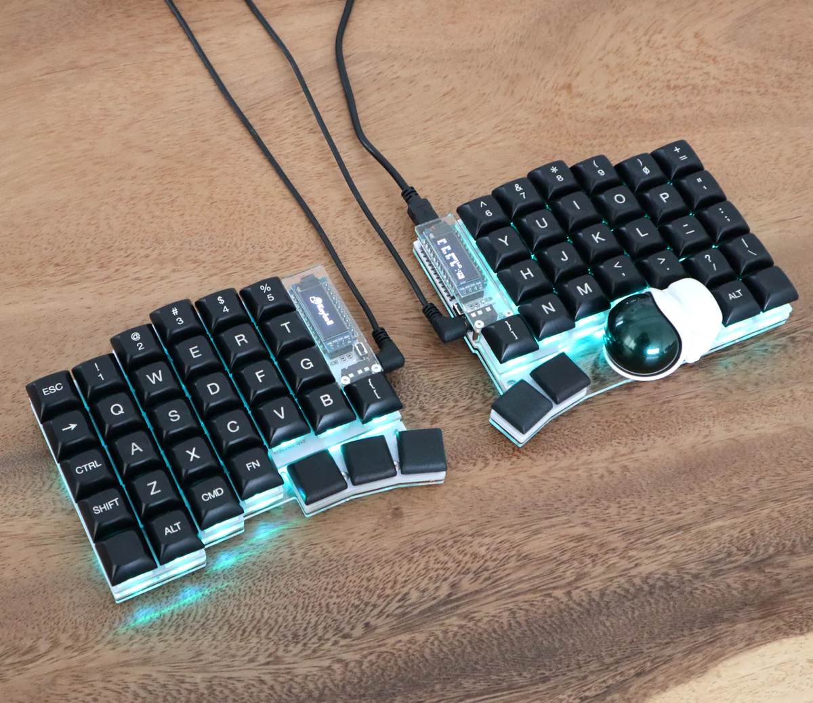

# キーボードについて


---

# 自作キーボードの世界

- **自作キーボード**とは、パーツを選んで組み立てるキーボード
- キースイッチ、キーキャップ、ケース、基板を自由に選択
- ファームウェアでキー配列を完全にカスタマイズ可能

---

# トラックボール付き分割キーボードのトレンド

<div class="columns">
<div class="left">

## Keyball時代（2021〜）
- Keyball44/61/39が大ヒット
- トラックボール内蔵の先駆け
- 有線接続、QMKファームウェア

</div>
<div class="right">

</div>
</div>

---

# トレンドの移行

```
* Keyball ─────┬──────────────────● roba├──────────────────● robaish└──────────────────● moNa2
                       薄型化、無線対応                     robaの派生                    洗練されたデザイン
```

**共通点**: トラックボール内蔵 × 分割 × 無線対応

---

# キー配列変更の可能性

| キーボード | カスタマイズ性 |
|-----------|---------------|
| **HHKB** | 専用ソフトで一部変更可能 |
| **QMK** | 完全カスタマイズ、有線向け |
| **ZMK** | 完全カスタマイズ、無線対応 |

- QMK/ZMKはオープンソースファームウェア
- どのキーにも好きな機能を割り当て可能
- レイヤー機能で少ないキーでも多機能に

---

# 配列を変えられることの良さ

- **ホームポジションから手を動かさない**
  - 矢印キー、マウス操作もホームポジションで
- **自分だけの最適解**を追求できる
- よく使うキーを打ちやすい位置に配置
- **レイヤー**で1つのキーに複数の役割
- 小指の負担軽減（Ctrl、Shift等の配置変更）

---

# 分割・無線キーボードのメリット

- **肩が開いた状態**で作業できる
  - 肩こり・猫背の改善
- **椅子のアームレストに置いて作業**
  - デスクに縛られない自由な姿勢
- ケーブルがないスッキリしたデスク
- 持ち運びやすい

---

# 私の構成

## 入手方法
- **組み立て済み**を購入（はんだ付け不要）
- 入手先
  - **BOOTH** - 作者から直接購入
  - **メルカリ** - 中古や組み立て代行品

---

# 私のキー配列

<!-- ここに配列画像を貼ってください -->

---

# まとめ

- 自作キーボードは**自由度の高いカスタマイズ**が魅力
- トラックボール付き分割キーボードが人気
- **分割・無線**で姿勢改善＆快適な作業環境
- 組み立て済みなら**はんだ付け不要**で始められる

**興味があればぜひ試してみてください！**

---

# ご清聴ありがとうございました

